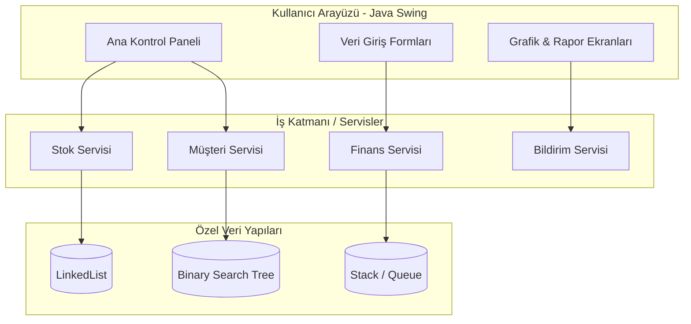

<div align="center">


  <h1>Akıllı Oto Galeri Sistemi (AOGS)</h1>

  <p>
    <b>Otomotiv sektörü için tasarlanmış, sıfır harici bağımlılık ilkesiyle geliştirilmiş, yüksek performanslı ve tam kapsamlı kurumsal galeri yönetim otomasyonu.</b>
  </p>

  <!-- Badges -->
  <p>
    <a href="https://www.java.com/"></a>
    <a href="#"></a>
    <a href="#"></a>
    <a href="#"></a>
    <br>
    <a href="https://github.com/zekierman/akilli-galeri-sistemi/commits/main"></a>
  </p>

  <p>
    <a href="#proje-özeti">Proje Özeti</a> •
    <a href="#mimari-ve-veri-yapıları">Mimari</a> •
    <a href="#kurulum-ve-dağıtım">Kurulum</a> •
    <a href="#resmi-dokümantasyonlar">Dokümantasyon</a>
  </p>

</div>

---

## Proje Özeti

**Akıllı Oto Galeri Sistemi (AOGS)**, araç alım-satım süreçlerini, ekspertiz kayıtlarını, müşteri ilişkilerini (CRM) ve finansal verileri tek bir merkezden yönetmek üzere tasarlanmış kurumsal bir masaüstü yazılımıdır. 

Geleneksel, kağıt veya basit tablolama (Excel vb.) yazılımlarına dayalı yönetim sistemlerinin aksine AOGS, **veri güvenliğini, operasyonel hızı ve süreç şeffaflığını** maksimize etmeyi hedefler. Projenin mühendislik açısından en güçlü yönü, standart Java Collections Framework kullanılmadan **tamamen sıfırdan yazılmış (custom) veri yapıları** üzerine inşa edilmiş olmasıdır.

## Temel Yetenekler ve Modüller

| Modül | Açıklama |
| :--- | :--- |
| **Araç Envanter & Stok Yönetimi** | Araçların marka, model, yıl, km, donanım ve anlık stok durumlarının uçtan uca yönetimi. |
| **Dijital Ekspertiz Analizi** | Araç parçalarındaki (boya, değişen, lokal boya) hasar durumlarının görsel işaretleme ile dijital kaydı. |
| **Müşteri İlişkileri (CRM)** | Alıcı ve satıcı veritabanı oluşturma, geçmiş satışların takibi ve müşteri bazlı analiz. |
| **Finans ve Muhasebe** | Alış-satış marjlarının hesaplanması, gelir-gider takibi ve anlık kar/zarar durum raporlaması. |
| **Akıllı Asistan (Bildirim)** | Muayene, kasko, sigorta ve vergi ödeme tarihlerini otomatik olarak takip eden hatırlatıcı servis. |
| **Gelişmiş Raporlama** | Belirli tarih aralıklarında stok hareketleri ve finansal durumlara dair detaylı veri dökümleri. |

---

## Mimari ve Veri Yapıları

AOGS, endüstri standartlarında bir yazılım mimarisine sahip olmakla birlikte, algoritmik verimlilik göz önünde bulundurularak tasarlanmıştır. **`java.util.*` koleksiyon kütüphaneleri (List, Set, Map vb.) bilerek kullanılmamış, projenin tamamı özel veri yapılarıyla örülmüştür.**

### Kullanılan Veri Yapıları:
- **`Custom LinkedList:`** Araç stok listeleri ve dinamik boyut gerektiren veri kümeleri için.
- **`Binary Search Tree (BST):`** Müşteri kayıtlarında ve plaka/şasi no tabanlı aramalarda üst düzey arama hızı elde etmek için.
- **`Queue & Stack:`** İşlem geçmişi (Undo/Redo mantığı) ve asenkron bildirim kuyrukları için.

### Sistem Mimarisi (Mermaid)



---

## Teknolojik Altyapı

<details>
<summary><b>Detaylı Teknoloji Listesini Gör (Tıklayın)</b></summary>
<br>

| Bileşen | Teknoloji / Yaklaşım | Tercih Nedeni |
| :--- | :--- | :--- |
| **Dil** | Java 17+ | Güçlü tip güvenliği, platform bağımsızlığı (WORA) |
| **Arayüz (GUI)** | Java Swing / AWT | Native masaüstü deneyimi, dış kütüphane bağımsızlığı |
| **Paradigma** | Nesne Yönelimli Programlama (OOP) | Kodun yeniden kullanılabilirliği ve yönetilebilirliği |
| **Versiyon Kontrol** | Git & GitHub | Dağıtık ekip çalışması, CI/CD uyumluluğu |
| **Dokümantasyon** | Markdown, Mermaid.js | Temiz ve sürdürülebilir proje belgelendirmesi |

</details>

---

## Proje Hiyerarşisi

Kod organizasyonu, Sorumlulukların Ayrılığı (Separation of Concerns) prensibine sadık kalınarak yapılandırılmıştır.

```text
AOGS
 ┣ backend
 ┃ ┣ src/main/java/com/galeri
 ┃ ┃ ┣ config           # Yapılandırma ve ayarlar (CORS, WebMvc ayarları vb.)
 ┃ ┃ ┣ controller       # Gelen HTTP isteklerini karşılayan API uç noktaları (Endpoints)
 ┃ ┃ ┣ dto              # Veri Transfer Nesneleri (İstemci ve sunucu arasındaki veri formatları)
 ┃ ┃ ┣ exception        # Projeye özel hata sınıfları ve merkezi hata yönetimi
 ┃ ┃ ┣ model            # Veritabanı tablolarını temsil eden varlıklar (Car, User, Ekspertiz vb.)
 ┃ ┃ ┣ repository       # Veritabanı erişim katmanı (JPA ve veritabanı sorguları)
 ┃ ┃ ┗ service          # Çekirdek iş mantıkları ve kuralların işlendiği asıl servisler
 ┃ ┗ pom.xml            # Maven kütüphane bağımlılıkları ve projenin inşa ayarları
 ┃
 ┗ frontend
   ┣ src
   ┃ ┣ api              # Backend ile veri alışverişini (HTTP isteklerini) yöneten modüller
   ┃ ┣ components       # Yeniden kullanılabilir arayüz parçaları (Buton, Modal, Tablo)
   ┃ ┣ pages            # Ana görünümler ve yönlendirmeye (routing) bağlı sayfalar
   ┃ ┗ theme            # Tasarım dili, genel stil ayarları ve renk paletleri
   ┣ package.json       # React proje bağımlılıkları ve çalıştırılabilir scriptler
   ┣ tailwind.config.js # Stil için kullanılan TailwindCSS yapılandırmaları
   ┗ vite.config.js     # Geliştirme sunucusu (dev server) ve build ayarları
```

---

## Kurulum ve Dağıtım

Proje bağımlılıklardan arındırıldığı için (Zero Dependency), kurulum süreci son derece basittir.

### 1. Ön Koşullar
Sisteminizde **Java Development Kit (JDK) 17** veya daha güncel bir sürümünün kurulu olduğundan ve `JAVA_HOME` ortam değişkeninin doğru ayarlandığından emin olun.
```bash
java -version
```


### 2. İndirme ve Derleme
Terminal veya Komut İstemcisi üzerinden aşağıdaki adımları sırasıyla uygulayın:

```bash
# Projeyi lokal bilgisayarınıza çekin
git clone https://github.com/zekierman/akilli-galeri-sistemi.git

# Proje klasörüne giriş yapın
cd akilli-galeri-sistemi
```

### 3. Veritabanı Yapılandırması (PostgreSQL)
Projenin verileri saklayabilmesi için yerel makinenizde bir PostgreSQL veritabanı bulunmalıdır:

**Veritabanı Oluşturma:** pgAdmin 4 veya tercih ettiğiniz bir araç üzerinden aogs adında bir veritabanı (database) oluşturun.

**Bağlantı Ayarları:** src/main/resources/application.properties dosyasını açarak aşağıdaki alanları kendi yerel veritabanı bilgilerinizle güncelleyin:

```cmd
spring.datasource.username=postgres
spring.datasource.password=kendi_sifreniz
```

### 4. Çalıştırma
**Windows Kullanıcıları:**
Kök dizinde bulunan `run.bat` dosyasına çift tıklayabilir veya terminal üzerinden çalıştırabilirsiniz:
```cmd
run.bat
```


## Resmi Dokümantasyonlar

Akademik ve mühendislik dokümantasyonlarımıza aşağıdan erişebilirsiniz:
- **[Sistem Gereksinimleri ve Fikir Belgesi](docs/proje-fikri.pdf)**
- **[Detaylı Proje Analiz Raporu (IEEE 830 Standartları)](docs/Akilli_Oto_Galeri_Proje_Analiz_Raporu.pdf)**
- **[UML Sınıf ve İlişki Diyagramı](docs/uml_sinif_diyagrami.txt)**
- **[Tasarım Raporu](docs/AOGS_TASARIM_RAPORU.pdf)**

---

## Mühendislik ve Geliştirme Ekibi

| Geliştirici | GitHub Profili | Görev / Sorumlu Modül |
|---|---|---|
| Emre Kuzal | [@emrkzl44](https://github.com/emrkzl44) | **Proje Yöneticisi** · Satış & Raporlama Modülleri (Backend) |
| Zeki Erman | [@zekierman](https://github.com/zekierman) | Araç Modülü (Backend) · Frontend: Dashboard, Araç Listesi, Araç Ekleme, Raporlama |
| Orhan Akman | [@orhaan2005-netizen](https://github.com/orhaan2005-netizen) | Müşteri Modülü (Backend) · Frontend: Müşteri Yönetimi, Satış İşlemi, Sigorta/Muayene, Layout |
| Osman Berat Paşa | [@Heyyyoooo](https://github.com/Heyyyoooo) | Ekspertiz Modülü (Backend) |
| Halil İbrahim Dinç | [@dinchalilibrahim](https://github.com/dinchalilibrahim) | Bildirim & Sigorta/Muayene Modülleri (Backend) |
| Eray Gök | [@erygk26](https://github.com/erygk26) | Entegrasyon & Test (api/client.js, CorsConfig, JUnit, dokümantasyon) |

---

## Açık Kaynak ve Katkı Süreci

Bu proje açık kaynaklıdır ve topluluğun katkılarına açıktır. Katkıda bulunmak için standart Git Flow prosedürlerini izleyebilirsiniz:

1. Bu depoyu (Fork) kopyalayın.
2. Üzerinde çalışacağınız özellik için bir dal oluşturun (`git checkout -b feature/MukemmelOzellik`).
3. Değişikliklerinizi kalıcı hale getirin (`git commit -m 'feat: Mükemmel özellik eklendi'`).
4. Dalınızı uzak sunucuya gönderin (`git push origin feature/MukemmelOzellik`).
5. Bir Birleştirme İsteği (Pull Request) oluşturun.

<div align="center">
  <br>
  
  <br>
  <p><i>Akıllı Oto Galeri Sistemi © 2026. Tüm hakları saklıdır. Eğitim ve akademik amaçlarla açık kaynaklı olarak paylaşılmıştır.</i></p>
</div>
